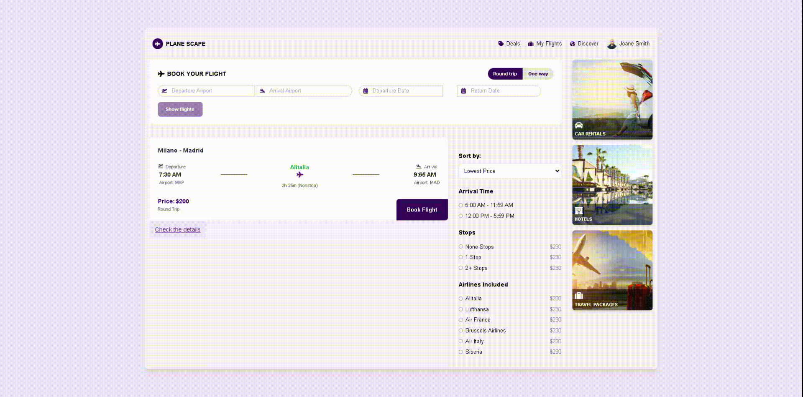

# Uçuş Rezervasyon Uygulaması

Bu, React ile geliştirilmiş bir Uçuş Rezervasyon Uygulamasıdır. Uygulama, kullanıcıların kalkış ve varış havaalanlarına göre uçuş araması yapmasına, seyahat tarihlerini seçmesine ve mevcut uçuş seçeneklerini görüntülemesine olanak tanır.



## Özellikler

- Kalkış ve varış havaalanlarına göre uçuş araması yapma.
- Tarih seçici kullanarak kalkış ve dönüş tarihlerini seçme.
- Mock verilerle uçuş sonuçlarını görüntüleme.
- Farklı ekran boyutları için duyarlı tasarım.

## Kullanılan Teknolojiler

- React
- React Router
- React DatePicker
- Tailwind CSS (stil için)

## Canlı Demo

Uygulamanın canlı demosunu [buradan](https://your-netlify-link.netlify.app) görüntüleyebilirsiniz.

## Kurulum

1. Depoyu klonlayın:

   ```bash
   git clone https://github.com/dursunaydin1/flight-reservation.git
   ```

2. Proje dizinine gidin:

   ```bash
   cd flight-reservation-app
   ```

3. Bağımlılıkları yükleyin:

   ```bash
   npm install
   ```

4. Geliştirme sunucusunu başlatın:

   ```bash
   npm start
   ```

5. Tarayıcınızı açın ve `http://localhost:3000` adresine gidin.

## Kullanım

1. İlgili giriş alanlarına kalkış ve varış havaalanlarını girin.
2. Kalkış ve dönüş tarihlerini seçin.
3. Mevcut uçuş seçeneklerini görüntülemek için "Show flights" butonuna tıklayın.

## Mock Veriler

Uygulama şu anda uçuş sonuçları için mock veriler kullanmaktadır. Mock verileri güncellemek için `src/data/mockAirports.js` ve `src/components/FlightResults.jsx` dosyalarını değiştirebilirsiniz.

## Katkıda Bulunma

Katkılarınızı bekliyoruz! Lütfen bir pull request gönderin veya bir sorun açın.

## Lisans

Bu proje MIT Lisansı ile lisanslanmıştır.
